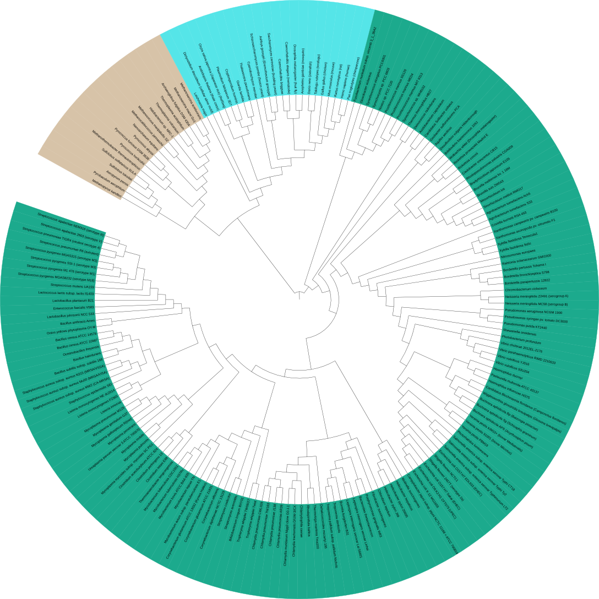
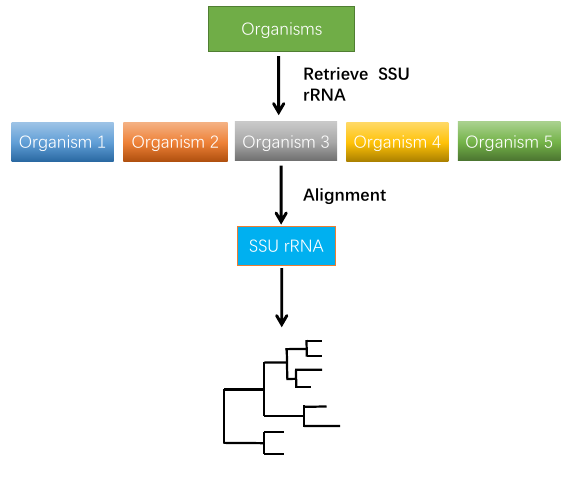
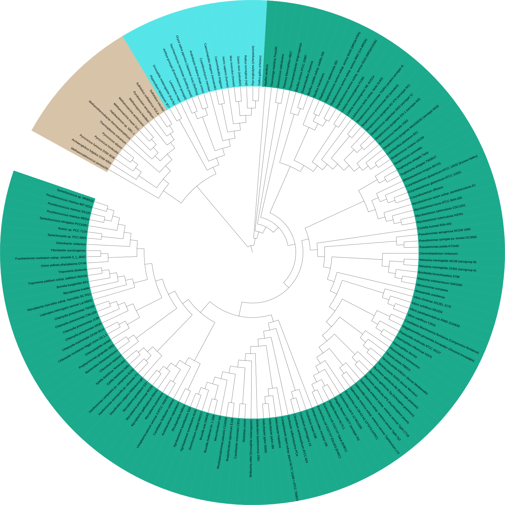
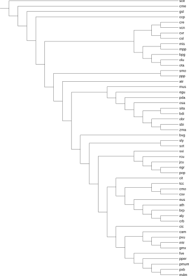
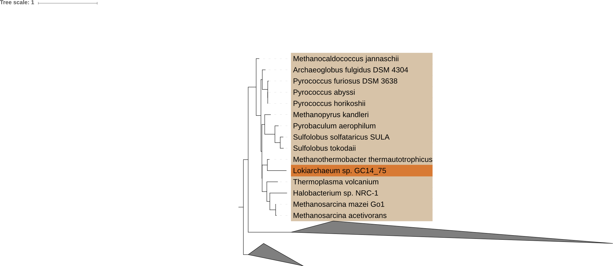

# PhySpeTree Tutorial 

## Automatically reconstruct Tree of Life

The tree-of-life always used to describe the relations between organisms are living and extinct.
Here we reconstruct tree of life by two method (HCP and SSU rRNA method) which contain 191 organisms.


### Auto build tree-of-life by highly conserved protein (HCP) method

* **Concept**


The main concept of the HCP method is concatenate highly conserved protein to a supermatrix and then build tree.
Here we prepared 31 highly conserved proteins to build tree. You can also check which [31 highly protein](faq.md#Physpe_reconstruct_phylogenetic_tree_database) were used.

####  1.Prepare species names list

Preparing the organisms names (abbreviated names) are same with [KEGG organisms][2] abbreviation. you can get KEGG organisms abbreviation form [KEGG API][3]. 
Here we reconstructed tree-of-life use 191 organisms names are [download][1]. the organisms names list as follow:

```bash

$ wget "https://xiaofeiyangyang.github.io/physpetools/example/191speciesnames.txt"

--2016-10-30 15:26:06--  https://xiaofeiyangyang.github.io/physpetools/example/191speciesnames.txt
Resolving xiaofeiyangyang.github.io (xiaofeiyangyang.github.io)... 151.101.48.133
Connecting to xiaofeiyangyang.github.io (xiaofeiyangyang.github.io)|151.101.48.133|:443... connected.
HTTP request sent, awaiting response... 200 OK
Length: 773 [text/plain]
Saving to: ‘191speciesnames.txt’

191speciesnames.txt          100%[==============================================>]     773  --.-KB/s    in 0s      

$ cat 191speciesnames.txt 
neq
pai
ape
sto
ssoa
tvo
tac
afu
.....
```   

####  2.Reconstruct phylogenetic tree by highly conserved protein method

When users use PhySpeTree build tree, should use `--hcp` arguments to specify use highly conserved protein method to build tree. The default use 1 thread 
to build tree. The `-t` parameter to set the number of threads to use. Here we used the default value 1 thread to build 191 species phylogenetic tree.

```
$ PhySpeTree autobuild -i 191speciesnames.txt -o 191_pro --hcp

Loading organisms names success.....

The result are store in:191_pro

Now loading data and constructing phylogenetic tree......
2016-10-30 15:32:07,894 Checking organisms INFO: The species: ges can't match in KEGG protein index database
2016-10-30 15:32:07,894 Checking organisms WARNING: These species can't match in KEGG protein index database so removed and reconstruct phylogenetic tree.
2016-10-30 15:32:07,894 KEGG INDEX DB INFO: Read organisms names success
2016-10-30 15:32:34,213 KEGG INDEX DB INFO: Retrieve and download of highly conserved protein 'Ribosomal protein L1' was successful store in p1.fasta file
2016-10-30 15:33:00,679 KEGG INDEX DB INFO: Retrieve and download of highly conserved protein 'Leucyl-tRNA synthetase' was successful store in p2.fasta file
2016-10-30 15:33:25,052 KEGG INDEX DB INFO: Retrieve and download of highly conserved protein 'Ribosomal protein L14' was successful store in p3.fasta file
2016-10-30 15:33:49,649 KEGG INDEX DB INFO: Retrieve and download of highly conserved protein 'Ribosomal protein L5' was successful store in p4.fasta file
2016-10-30 15:34:14,510 KEGG INDEX DB INFO: Retrieve and download of highly conserved protein 'Ribosomal protein S7' was successful store in p5.fasta file
2016-10-30 15:34:41,123 KEGG INDEX DB INFO: Retrieve and download of highly conserved protein 'Arginyl-tRNA synthetase' was successful store in p6.fasta file
2016-10-30 15:34:41,123 KEGG INDEX DB INFO: Retrieve from KEGG database 6 highly conserved proteins
......
```

#### 3.Get the tree file  


#### 4.Use iview module annotating tree

PhySpeTree provided iview module to annotating tree by iTol, iTol is a very popular online tool for the display, annotation and management of phylogenetic trees.
When you use iview module to annotating tree, only drop the output the generate files to your iTol account and display tree.


* Change abbreviated label names to full names use `--labels` arguments.

```
$ PhySpeTree iview -i 191speciesnames.txt --labels
Change abbreviation names to full names complete
change labels file was save in iview/labels.txt

$ cd iview

$ cat labels.txt 
LABELS
SEPARATOR TAB
DATA
neq     Nanoarchaeum equitans
pai     Pyrobaculum aerophilum
ape     Aeropyrum pernix
sto     Sulfolobus tokodaii
ssoa    Sulfolobus solfataricus SULA
tvo     Thermoplasma volcanium
tac     Thermoplasma acidophilum
afu     Archaeoglobus fulgidus DSM 4304
hal     Halobacterium sp. NRC-1
mac     Methanosarcina acetivorans
mma     Methanosarcina mazei Go1
pfu     Pyrococcus furiosus DSM 3638
pho     Pyrococcus horikoshii
pab     Pyrococcus abyssi
mth     Methanothermobacter thermautotrophicus
mka     Methanopyrus kandleri
mmp     Methanococcus maripaludis S2
.....
```

* Drop `labels.txt` to you iTol account and view the phylogenetic tree.


* Color range by phylum use `-a` parameter to specified. The default annotation by phylum.

```
$ PhySpeTree iview -i 191speciesnames.txt -o iview --range -a phylum
Color range by phylum was complete.
Color range annotation was save in iview/range_color_by_phylum.txt

$ cd iview

$ cat range_color_by_phylum.txt 
TREE_COLORS
SEPARATOR TAB
DATA
neq     range   #996433 Archaea
pai     range   #996433 Archaea
ape     range   #996433 Archaea
sto     range   #996433 Archaea
ssoa    range   #996433 Archaea
tvo     range   #996433 Archaea
tac     range   #996433 Archaea
afu     range   #996433 Archaea
hal     range   #996433 Archaea
mac     range   #996433 Archaea
mma     range   #996433 Archaea
pfu     range   #996433 Archaea
pho     range   #996433 Archaea
pab     range   #996433 Archaea
mth     range   #996433 Archaea
mka     range   #996433 Archaea
mmp     range   #996433 Archaea
mja     range   #996433 Archaea
.....
```

* Drop `range_color_by_phylum.txt` to you iTol account and view the phylogenetic tree.




### Auto build tree-of-life by SSU rRNA

* **Concept**



PhySpeTree provided auto reconstruct phylogenetic tree by SSU rRNA method, the concept of this method was aligned organisms SSU rRNA sequence and then reconstruct 
phylogenetic tree.


####  1.Prepare organism names list, 191 organisms names list [download][1]

```bash

$ wget "https://xiaofeiyangyang.github.io/physpetools/example/191speciesnames.txt"

--2016-10-30 15:26:06--  https://xiaofeiyangyang.github.io/physpetools/example/191speciesnames.txt
Resolving xiaofeiyangyang.github.io (xiaofeiyangyang.github.io)... 151.101.48.133
Connecting to xiaofeiyangyang.github.io (xiaofeiyangyang.github.io)|151.101.48.133|:443... connected.
HTTP request sent, awaiting response... 200 OK
Length: 773 [text/plain]
Saving to: ‘191speciesnames.txt’

$ cat 191speciesnames.txt 
neq
pai
ape
sto
ssoa
tvo
tac
afu
.....
```

####  2.Reconstruct phylogenetic tree by SSU rRNA method

```
$ PhySpeTree autobuild -i 191speciesnames.txt -o 191_rna --srna
Loading organisms names success.....

The result are store in:191_rna

Now loading data and constructing phylogenetic tree......
2016-10-30 15:40:17,107 Checking organisms INFO: The organism: neq can't match in SSU rRNA database
2016-10-30 15:40:17,107 Checking organisms INFO: The organism: ape can't match in SSU rRNA database
2016-10-30 15:40:17,107 Checking organisms INFO: The organism: tac can't match in SSU rRNA database
2016-10-30 15:40:17,107 Checking organisms INFO: The organism: mmp can't match in SSU rRNA database
2016-10-30 15:40:17,107 Checking organisms INFO: The organism: gla can't match in SSU rRNA database
2016-10-30 15:40:17,107 Checking organisms INFO: The organism: tps can't match in SSU rRNA database
2016-10-30 15:40:17,107 Checking organisms INFO: The organism: cho can't match in SSU rRNA database
2016-10-30 15:40:17,107 Checking organisms INFO: The organism: ddi can't match in SSU rRNA database
2016-10-30 15:40:17,107 Checking organisms INFO: The organism: spo can't match in SSU rRNA database
2016-10-30 15:40:17,107 Checking organisms INFO: The organism: aga can't match in SSU rRNA database
2016-10-30 15:40:17,107 Checking organisms INFO: The organism: tru can't match in SSU rRNA database
2016-10-30 15:40:17,107 Checking organisms INFO: The organism: mpu can't match in SSU rRNA database
2016-10-30 15:40:17,107 Checking organisms INFO: The organism: lin can't match in SSU rRNA database
2016-10-30 15:40:17,107 Checking organisms INFO: The organism: ban can't match in SSU rRNA database
2016-10-30 15:40:17,107 Checking organisms INFO: The organism: bce can't match in SSU rRNA database
2016-10-30 15:40:17,108 Checking organisms INFO: The organism: ljo can't match in SSU rRNA database
2016-10-30 15:40:17,108 Checking organisms INFO: The organism: san can't match in SSU rRNA database
2016-10-30 15:40:17,108 Checking organisms INFO: The organism: spg can't match in SSU rRNA database
2016-10-30 15:40:17,108 Checking organisms INFO: The organism: ges can't match in SSU rRNA database
2016-10-30 15:40:17,108 Checking organisms INFO: The organism: lis can't match in SSU rRNA database
2016-10-30 15:40:17,108 Checking organisms INFO: The organism: sco can't match in SSU rRNA database
2016-10-30 15:40:17,108 Checking organisms INFO: The organism: cdi can't match in SSU rRNA database
2016-10-30 15:40:17,108 Checking organisms INFO: The organism: mle can't match in SSU rRNA database
2016-10-30 15:40:17,108 Checking organisms INFO: The organism: wsu can't match in SSU rRNA database
2016-10-30 15:40:17,108 Checking organisms INFO: The organism: rpr can't match in SSU rRNA database
2016-10-30 15:40:17,108 Checking organisms INFO: The organism: bpe can't match in SSU rRNA database
2016-10-30 15:40:17,108 Checking organisms INFO: The organism: bpa can't match in SSU rRNA database
2016-10-30 15:40:17,108 Checking organisms INFO: The organism: ppr can't match in SSU rRNA database
2016-10-30 15:40:17,108 Checking organisms WARNING: These species can't match in SSU rRNA database so removing and reconstructing phylogenetic tree.
2016-10-30 15:40:17,108 SSU rRNA DB INFO: Read organisms names success
2016-10-30 15:40:24,505 SSU rRNA DB INFO: Retrieve and download of organism 'pai' SSU rRNA sequence was successful
2016-10-30 15:40:26,960 SSU rRNA DB INFO: Retrieve and download of organism 'sto' SSU rRNA sequence was successful
2016-10-30 15:40:29,313 SSU rRNA DB INFO: Retrieve and download of organism 'ssoa' SSU rRNA sequence was successful
2016-10-30 15:40:32,387 SSU rRNA DB INFO: Retrieve and download of organism 'tvo' SSU rRNA sequence was successful
2016-10-30 15:40:35,158 SSU rRNA DB INFO: Retrieve and download of organism 'afu' SSU rRNA sequence was successful
2016-10-30 15:40:37,507 SSU rRNA DB INFO: Retrieve and download of organism 'hal' SSU rRNA sequence was successful
2016-10-30 15:40:41,282 SSU rRNA DB INFO: Retrieve and download of organism 'mac' SSU rRNA sequence was successful
......
```

#### 3.Get the tree file  


#### 4.Use iview annotating tree

* Change abbreviated label names to full names use `--labels`

```
$ PhySpeTree iview -i 191speciesnames.txt --labels
Change abbreviation names to full names complete
change labels file was save in iview/labels.txt

$ cd iview

$ cat labels.txt 
LABELS
SEPARATOR TAB
DATA
neq     Nanoarchaeum equitans
pai     Pyrobaculum aerophilum
ape     Aeropyrum pernix
sto     Sulfolobus tokodaii
ssoa    Sulfolobus solfataricus SULA
tvo     Thermoplasma volcanium
tac     Thermoplasma acidophilum
afu     Archaeoglobus fulgidus DSM 4304
hal     Halobacterium sp. NRC-1
mac     Methanosarcina acetivorans
mma     Methanosarcina mazei Go1
pfu     Pyrococcus furiosus DSM 3638
pho     Pyrococcus horikoshii
pab     Pyrococcus abyssi
mth     Methanothermobacter thermautotrophicus
mka     Methanopyrus kandleri
mmp     Methanococcus maripaludis S2
.....
```

* Tree view in iTol


* Color range by phylum

```
$ PhySpeTree iview -i 191speciesnames.txt -o iview --range -a phylum
Color range by phylum was complete.
Color range annotation was save in iview/range_color_by_phylum.txt

$ cd iview

$ cat range_color_by_phylum.txt 
TREE_COLORS
SEPARATOR TAB
DATA
neq     range   #996433 Archaea
pai     range   #996433 Archaea
ape     range   #996433 Archaea
sto     range   #996433 Archaea
ssoa    range   #996433 Archaea
tvo     range   #996433 Archaea
tac     range   #996433 Archaea
afu     range   #996433 Archaea
hal     range   #996433 Archaea
mac     range   #996433 Archaea
mma     range   #996433 Archaea
pfu     range   #996433 Archaea
pho     range   #996433 Archaea
pab     range   #996433 Archaea
mth     range   #996433 Archaea
mka     range   #996433 Archaea
mmp     range   #996433 Archaea
mja     range   #996433 Archaea
.....
```

* Tree view in iTol




* Color range by class

```
$ PhySpeTree iview -i 191speciesnames.txt --range -a class
Color range by class was complete.
Color range annotation was save in iview/range_color_by_class.txt

$ cd iview

$ cat range_color_by_class.txt 
TREE_COLORS
SEPARATOR TAB
DATA
neq     range   #4A959E Nanoarchaeota
pai     range   #58CD80 Crenarchaeota
ape     range   #58CD80 Crenarchaeota
sto     range   #58CD80 Crenarchaeota
ssoa    range   #58CD80 Crenarchaeota
tvo     range   #639BB0 Euryarchaeota
tac     range   #639BB0 Euryarchaeota
afu     range   #639BB0 Euryarchaeota
hal     range   #639BB0 Euryarchaeota
mac     range   #639BB0 Euryarchaeota
mma     range   #639BB0 Euryarchaeota
pfu     range   #639BB0 Euryarchaeota
pho     range   #639BB0 Euryarchaeota
pab     range   #639BB0 Euryarchaeota
mth     range   #639BB0 Euryarchaeota
mka     range   #639BB0 Euryarchaeota
mmp     range   #639BB0 Euryarchaeota
mja     range   #639BB0 Euryarchaeota
gla     range   #C5D49E Diplomonads
lma     range   #899DDB Euglenozoa
tps     range   #7DD2ED Stramenopiles
cho     range   #99A01A Alveolates
.....
```

* Tree view in iTol


## Auto build a plant tree

####  1.Prepare organisms names list

Here we automatically reconstructed 52 plants phylogenetic tree by PhySpeTree use highly conserved protein method. The species list [download][4].

```bash

$ wget "https://xiaofeiyangyang.github.io/physpetools/example/52plantsnames.txt"

--2016-10-30 15:44:25--  https://xiaofeiyangyang.github.io/physpetools/example/52plantsnames.txt
Resolving xiaofeiyangyang.github.io (xiaofeiyangyang.github.io)... 151.101.48.133
Connecting to xiaofeiyangyang.github.io (xiaofeiyangyang.github.io)|151.101.48.133|:443... connected.
HTTP request sent, awaiting response... 200 OK
Length: 211 [text/plain]
Saving to: ‘52plantsnames.txt’

52plantsnames.txt            100%[==============================================>]     211  --.-KB/s    in 0s      

2016-10-30 15:44:27 (120 MB/s) - ‘52plantsnames.txt’ saved [211/211]

$ cat 52plantsnames.txt
aly
ath
atr
bdi
bpg
brp
bvg
cam
ccp
cic
cit
cme
cmo
.....
```

####  2.Reconstruct phylogenetic tree by highly conserved protein method

```
$ PhySpeTree autobuild -i 52plantsnames.txt -o 52plant_pro --hcp -t 6

Loading organisms names success.....

The result are store in:52plant_pro

Now loading data and constructing phylogenetic tree......
2016-10-30 15:48:23,420 KEGG INDEX DB INFO: Read organisms names success
2016-10-30 15:48:36,020 KEGG INDEX DB INFO: Retrieve and download of highly conserved protein 'Leucyl-tRNA synthetase' was successful store in p1.fasta file
2016-10-30 15:48:42,369 KEGG INDEX DB INFO: Retrieve and download of highly conserved protein 'Metal-dependent proteases with chaperone activity' was successful store in p2.fasta file
2016-10-30 15:48:46,774 KEGG INDEX DB INFO: Retrieve and download of highly conserved protein 'Phenylalanine-tRNA synthethase alpha subunit' was successful store in p3.fasta file
2016-10-30 15:48:50,559 KEGG INDEX DB INFO: Retrieve and download of highly conserved protein 'Preprotein translocase subunit SecY' was successful store in p4.fasta file
2016-10-30 15:48:54,153 KEGG INDEX DB INFO: Retrieve and download of highly conserved protein 'Ribosomal protein L15' was successful store in p5.fasta file
2016-10-30 15:48:57,631 KEGG INDEX DB INFO: Retrieve and download of highly conserved protein 'Ribosomal protein L16/L10E' was successful store in p6.fasta file
2016-10-30 15:49:01,311 KEGG INDEX DB INFO: Retrieve and download of highly conserved protein 'Ribosomal protein L18' was successful store in p7.fasta file
2016-10-30 15:49:09,038 KEGG INDEX DB INFO: Retrieve and download of highly conserved protein 'Ribosomal protein L22' was successful store in p8.fasta file
2016-10-30 15:49:18,417 KEGG INDEX DB INFO: Retrieve and download of highly conserved protein 'Ribosomal protein L3' was successful store in p9.fasta file
2016-10-30 15:49:24,771 KEGG INDEX DB INFO: Retrieve and download of highly conserved protein 'Ribosomal protein L5' was successful store in p10.fasta file
2016-10-30 15:49:31,840 KEGG INDEX DB INFO: Retrieve and download of highly conserved protein 'Ribosomal protein L6P/L9E' was successful store in p11.fasta file
2016-10-30 15:49:36,652 KEGG INDEX DB INFO: Retrieve and download of highly conserved protein 'Ribosomal protein S11' was successful store in p12.fasta file
2016-10-30 15:49:41,464 KEGG INDEX DB INFO: Retrieve and download of highly conserved protein 'Ribosomal protein S15P/S13E' was successful store in p13.fasta file
2016-10-30 15:49:46,272 KEGG INDEX DB INFO: Retrieve and download of highly conserved protein 'Ribosomal protein S17' was successful store in p14.fasta file
2016-10-30 15:49:51,186 KEGG INDEX DB INFO: Retrieve and download of highly conserved protein 'Ribosomal protein S2' was successful store in p15.fasta file
2016-10-30 15:50:04,278 KEGG INDEX DB INFO: Retrieve and download of highly conserved protein 'Ribosomal protein S8' was successful store in p16.fasta file
2016-10-30 15:50:13,914 KEGG INDEX DB INFO: Retrieve and download of highly conserved protein 'Seryl-tRNA synthetase' was successful store in p17.fasta file
2016-10-30 15:50:19,753 KEGG INDEX DB INFO: Retrieve and download of highly conserved protein 'Ribosomal protein S13' was successful store in p18.fasta file
2016-10-30 15:50:19,753 KEGG INDEX DB INFO: Retrieve from KEGG database 18 highly conserved proteins
......
```


####  3.Get tree file




#### 4.Use iview annotating tree

* Change label names use `--labels`

```
$ PhySpeTree iview -i 52plantsnames.txt --labels
Change abbreviation names to full names complete
change labels file was save in iview/labels.txt

$ cd iview

$ cat labels.txt 
LABELS
SEPARATOR TAB
DATA
aly     Arabidopsis lyrata (lyrate rockcress)
ath     Arabidopsis thaliana (thale cress)
atr     Amborella trichopoda
bdi     Brachypodium distachyon
bpg     Bathycoccus prasinos
brp     Brassica rapa (field mustard)
bvg     Beta vulgaris (sugar beet)
cam     Cicer arietinum (chickpea)
ccp     Chondrus crispus (carragheen)
cic     Citrus clementina (mandarin orange)
cit     Citrus sinensis (Valencia orange)
cme     Cyanidioschyzon merolae
cmo     Cucumis melo (muskmelon)
crb     Capsella rubella
cre     Chlamydomonas reinhardtii
csl     Coccomyxa subellipsoidea
csv     Cucumis sativus (cucumber)
cvr     Chlorella variabilis

.....
```  

* Tree view by iTol


* Color range by class

```
$ PhySpeTree iview -i 52plantsnames.txt -o iview --range -a phylum
Color range by class was complete.
Color range annotation was save in iview/range_color_by_class.txt
$ cd iview

$ cat range_color_by_class.txt 
TREE_COLORS
SEPARATOR TAB
DATA
aly     range   #1C748D Eudicots
ath     range   #1C748D Eudicots
atr     range   #C4DE94 Basal Magnoliophyta
bdi     range   #854B9F Monocots
bpg     range   #784CE5 Green algae
brp     range   #1C748D Eudicots
bvg     range   #1C748D Eudicots
cam     range   #1C748D Eudicots
ccp     range   #CEDDB3 Red algae
cic     range   #1C748D Eudicots
cit     range   #1C748D Eudicots
cme     range   #CEDDB3 Red algae
cmo     range   #1C748D Eudicots
crb     range   #1C748D Eudicots
cre     range   #784CE5 Green algae
csl     range   #784CE5 Green algae
.....
```

* Tree view use iview module by iTol


## Extend tree with a new organism


Some time we want to extend tree with a new organisms, use PhySpeTree user can easy do it.


### Extend tree by SSU rRNA method

* **Concept**


Here we inserted new organism *Lokiarchaeum sp. GC14_75 (loki)* to tree-of-life.


#### 1.Prepare new organism SSU rRNA sequence

When using SSU rRNA method to insert a new organism, the user needs prepare the new organism SSU rRNA sequence. Here we prepared the new organism *Lokiarchaeum sp. GC14_75 (loki)*
SSU rRNA sequence save with FASTA format. example download [extend_rna_olki.fasta][5]

* Download the example file:

```bash

$ wget "https://xiaofeiyangyang.github.io/physpetools/example/extend_rna_loki.fasta"

--2016-10-30 15:54:38--  https://xiaofeiyangyang.github.io/physpetools/example/extend_rna_loki.fasta
Resolving xiaofeiyangyang.github.io (xiaofeiyangyang.github.io)... 151.101.24.133
Connecting to xiaofeiyangyang.github.io (xiaofeiyangyang.github.io)|151.101.24.133|:443... connected.
HTTP request sent, awaiting response... 200 OK
Length: 1200 (1.2K) [application/octet-stream]
Saving to: ‘extend_rna_loki.fasta’

extend_rna_loki.fasta        100%[==============================================>]   1.17K  --.-KB/s    in 0s      

2016-10-30 15:54:39 (553 MB/s) - ‘extend_rna_loki.fasta’ saved [1200/1200]

```

* check the download example file:

```
$ cat extend_rna_olki.fasta
>loki
GAGAUGGGUACUGAGACAACGACCCAGGCCUUACGAGGCGCAGCAGGCGCGAAACCUCCGCAAUACACGAAAGUGUGACG
GGGUUACCCAAAGUGUUCAAUUAUGAACUGUGGUAGGUGAGUAAUGUUCCCUACUAGAAAGGAGAGGGCAAGGCUGGUGC
CAGCCGCCGCGGUAAAACCAGCUCUUCAAGUGGUCGGGAUAAUUAUUGGGCUUAAAGUGUCCGUAGCCGGUUUAGUAAGU
UCCUGGUAAAAUCGGGUAGCUUAACUAUCUGUAUGCUAGGAAUACUGCUAUACUAGAGGACGGGAGAGGUCUGAGGUACU
ACAGGGGUAGGGGUGAAAUCUUAUAAUCCUUGUAGGACCACCAGUGGCGAAGGCGUCAGACUGGAACGUGCCUGACGGUG
AGGGACGAAAGCCAGGGGAGCGAACCGGAUUAGAUACCCGGGUAGUCCUGGCCGUAAACGAUGCAUACUAGGUGAUGGCA
UGGCCAUGAGCCAUGUCAGUGCCGUAGGGAAACCGUUAAGUGUGCCGCCUGGGAAGUACGGUCGCAAGGCUAAAACUUAA
AGGAAUUGGCGGGGGAGCACCACAAGGGGUGAAGCCUGCGGUUCAAUUGGACUCAACGCCGGGAAACUUACCAGGGGAGA
CAGCAGAAUGAUGGUCAGGUUGACGACCUUACCUGACAAGCUGAGAGGAGGUGCAUGGCCGUCGCCAGUUCGUGCUGUGA
GGUAUCCUGUUAAGUCAGGCAACGAACGAGAUCCGCACCUUUAUUUGCCAGCAAGAAGUCACGACUUCGUUGGGAACACU
AAAGGGACCGCCGUCGAUAAGACGGAGGAAGGAGCGGGCAAAGGCAGGUCAGUAUGCCCCGAAACCCCUGGGCUACACGC
GGGCUGCAAUGGUAUGAACAAUGGGCUGUAACUCCGAAAGGAGAAACCAAUCCCGAAAUCAUAUCUCAGUGGGAAUUGUC
GGCUGUAACCCGCCGACAUGAACGUGGAAUCCCUAGUAAUCGUGUGUCAUCAUCGCACGGUGAAUACGUCUCUGCUCCUU
GCACACACCGCCCGUCGCUCCAUCCGAGUGUGCUAAAAAUGAGGUAUGGUCAGUCUGGUCGUAUCGAAUUUCUAGUAUGC
GAGGGGGGAGAAGUCGUAACAAGGUAGCCGUAGGGGAACCUGCGGCUGGAUCACCUCCU

```

#### 2.Insert a new organism to tree-of-life by SSU rRNA method

Reconstruct phylogenetic tree by extend SSU rRNA method, you should use `--esrna` to specify the method and use `-e` parameter specify
the extend organism SSU rRNA sequence file.


```
$ PhySpeTree autobuild -i 191speciesnames.txt -o extend_rna -e extend_rna_loki.fasta --esrna -t 6

Loading organisms names success.....

The result are store in:extend_rna

Now loading data and constructing phylogenetic tree......
2016-10-30 16:10:01,551 Checking organisms INFO: The organism: neq can't match in SSU rRNA database
2016-10-30 16:10:01,551 Checking organisms INFO: The organism: ape can't match in SSU rRNA database
2016-10-30 16:10:01,551 Checking organisms INFO: The organism: tac can't match in SSU rRNA database
2016-10-30 16:10:01,551 Checking organisms INFO: The organism: mmp can't match in SSU rRNA database
2016-10-30 16:10:01,551 Checking organisms INFO: The organism: gla can't match in SSU rRNA database
2016-10-30 16:10:01,551 Checking organisms INFO: The organism: tps can't match in SSU rRNA database
2016-10-30 16:10:01,551 Checking organisms INFO: The organism: cho can't match in SSU rRNA database
2016-10-30 16:10:01,551 Checking organisms INFO: The organism: ddi can't match in SSU rRNA database
2016-10-30 16:10:01,551 Checking organisms INFO: The organism: spo can't match in SSU rRNA database
2016-10-30 16:10:01,552 Checking organisms INFO: The organism: aga can't match in SSU rRNA database
2016-10-30 16:10:01,552 Checking organisms INFO: The organism: tru can't match in SSU rRNA database
2016-10-30 16:10:01,552 Checking organisms INFO: The organism: mpu can't match in SSU rRNA database
2016-10-30 16:10:01,552 Checking organisms INFO: The organism: lin can't match in SSU rRNA database
2016-10-30 16:10:01,552 Checking organisms INFO: The organism: ban can't match in SSU rRNA database
2016-10-30 16:10:01,552 Checking organisms INFO: The organism: bce can't match in SSU rRNA database
2016-10-30 16:10:01,552 Checking organisms INFO: The organism: ljo can't match in SSU rRNA database
2016-10-30 16:10:01,552 Checking organisms INFO: The organism: san can't match in SSU rRNA database
2016-10-30 16:10:01,552 Checking organisms INFO: The organism: spg can't match in SSU rRNA database
2016-10-30 16:10:01,552 Checking organisms INFO: The organism: ges can't match in SSU rRNA database
2016-10-30 16:10:01,552 Checking organisms INFO: The organism: lis can't match in SSU rRNA database
2016-10-30 16:10:01,552 Checking organisms INFO: The organism: sco can't match in SSU rRNA database
2016-10-30 16:10:01,552 Checking organisms INFO: The organism: cdi can't match in SSU rRNA database
2016-10-30 16:10:01,552 Checking organisms INFO: The organism: mle can't match in SSU rRNA database
2016-10-30 16:10:01,552 Checking organisms INFO: The organism: wsu can't match in SSU rRNA database
2016-10-30 16:10:01,552 Checking organisms INFO: The organism: rpr can't match in SSU rRNA database
2016-10-30 16:10:01,552 Checking organisms INFO: The organism: bpe can't match in SSU rRNA database
2016-10-30 16:10:01,552 Checking organisms INFO: The organism: bpa can't match in SSU rRNA database
2016-10-30 16:10:01,552 Checking organisms INFO: The organism: ppr can't match in SSU rRNA database
2016-10-30 16:10:01,552 Checking organisms WARNING: These species can't match in SSU rRNA database so removing and reconstructing phylogenetic tree.
2016-10-30 16:10:01,552 SSU rRNA DB INFO: Read organisms names success
2016-10-30 16:10:02,263 SSU rRNA DB INFO: Retrieve and download of organism 'pai' SSU rRNA sequence was successful
2016-10-30 16:10:02,468 SSU rRNA DB INFO: Retrieve and download of organism 'sto' SSU rRNA sequence was successful
2016-10-30 16:10:02,672 SSU rRNA DB INFO: Retrieve and download of organism 'ssoa' SSU rRNA sequence was successful
2016-10-30 16:10:02,878 SSU rRNA DB INFO: Retrieve and download of organism 'tvo' SSU rRNA sequence was successful
2016-10-30 16:10:04,408 SSU rRNA DB INFO: Retrieve and download of organism 'afu' SSU rRNA sequence was successful
2016-10-30 16:10:04,615 SSU rRNA DB INFO: Retrieve and download of organism 'hal' SSU rRNA sequence was successful
2016-10-30 16:10:05,085 SSU rRNA DB INFO: Retrieve and download of organism 'mac' SSU rRNA sequence was successful
2016-10-30 16:10:05,638 SSU rRNA DB INFO: Retrieve and download of organism 'mma' SSU rRNA sequence was successful
2016-10-30 16:10:05,841 SSU rRNA DB INFO: Retrieve and download of organism 'pfu' SSU rRNA sequence was successful
2016-10-30 16:10:06,086 SSU rRNA DB INFO: Retrieve and download of organism 'pho' SSU rRNA sequence was successful
2016-10-30 16:10:06,590 SSU rRNA DB INFO: Retrieve and download of organism 'pab' SSU rRNA sequence was successful
2016-10-30 16:10:07,100 SSU rRNA DB INFO: Retrieve and download of organism 'mth' SSU rRNA sequence was successful
2016-10-30 16:10:07,303 SSU rRNA DB INFO: Retrieve and download of organism 'mka' SSU rRNA sequence was successful
.....
```


#### 3.View tree by iTol





### Extend tree by highly conserved protein (HCP) method

* **Concept**


#### 1.Check prepare proteins

When using SSU rRNA method to insert a new organism, the user should use `check` method to check what
highly conserved protein will be prepared.

```
$ PhySpeTree check -i 191speciesnames.txt --ehcp
'Ribosomal protein L1' ----------------------------------> p1.fasta

'Leucyl-tRNA synthetase' ----------------------------------> p2.fasta

'Ribosomal protein L14' ----------------------------------> p3.fasta

'Ribosomal protein L5' ----------------------------------> p4.fasta

'Ribosomal protein S7' ----------------------------------> p5.fasta

'Arginyl-tRNA synthetase' ----------------------------------> p6.fasta

Checked extend highly conserved proteins is completed.
Checked result was store in check/PhySpeTree_echp_extend.txt
......
```


#### 2. Prepare highly conserved proteins

After use check command, we should prepare six highly conserved protein and store this highly conserved protein to p1 ~ p6 FASTA format files.
The highly protein protein names are know with `check` command. Here we prepared *Lokiarchaeum sp. GC14_75 (loki)* highly conserved proteins stored in p1 ~ p6 files.
Download [highly_conserved_protein_loki][6]

* Download example files：

```bash
$ wget "https://xiaofeiyangyang.github.io/physpetools/example/highly_conserved_protein_loki.tar.gz"

--2016-10-30 16:36:48--  https://xiaofeiyangyang.github.io/physpetools/example/highly_conserved_protein_loki.tar.gz
Resolving xiaofeiyangyang.github.io (xiaofeiyangyang.github.io)... 151.101.48.133
Connecting to xiaofeiyangyang.github.io (xiaofeiyangyang.github.io)|151.101.48.133|:443... connected.
HTTP request sent, awaiting response... 200 OK
Length: 1810 (1.8K) [application/octet-stream]
Saving to: ‘highly_conserved_protein_loki.tar.gz’

highly_conserved_protein_lok 100%[==============================================>]   1.77K  --.-KB/s    in 0s      

2016-10-30 16:36:50 (623 MB/s) - ‘highly_conserved_protein_loki.tar.gz’ saved [1810/1810]

```


```bash
$ tar -zxvf highly_conserved_protein_loki.tar.gz

highly_conserved_protein_loki/
highly_conserved_protein_loki/p1.fasta
highly_conserved_protein_loki/p2.fasta
highly_conserved_protein_loki/p3.fasta
highly_conserved_protein_loki/p4.fasta
highly_conserved_protein_loki/p5.fasta
highly_conserved_protein_loki/p6.fasta

$ cd extend_pro_loki
$ ls
p1.fasta  p2.fasta  p3.fasta  p4.fasta  p5.fasta  p6.fast

$ cat p1.fasta 
>loki
MKVDDNLLKQSLNAAIDFSVRKKEGFKDRVRKFDETIDLIINIKDVNLNDPKNRIDKEII
LTNEIVEEEKLNICVIASGEILLEAKKAGVETLDRDALIKLNNEEKKHKKKFAKKYEFFI
VEDKMMRDVARYLARFLGPLGKMPKPFPTGYGIISSPGDLRTAVERYKKVIRIQMKKQPI
IFAKIGKKSMEIDRLFDNMKTVIDFIADQMPHKFNNFKSMYLKSSMGKPIKVTEEFLKSL
EV
```

#### 3.Insert a new organism to tree-of-life by HCP method


```
$ PhySpeTree autobuild -i 191speciesnames.txt -o extend_pro_loki -e highly_consrved_protein_loki --ehcp -t 6
Loading organisms names success.....

The result are store in:extend_pro_loki

Now loading data and constructing species phylogenetic tree......
2016-09-08 15:49:46,391 Checking organisms INFO: The organism: ges
2016-09-08 15:49:46,392 Checking organisms WARNING: There organisms can't match in KEGG database so removed and reconstruct phylogenetic tree
2016-09-08 15:49:46,392 kegg DB INFO: Read organisms names success
2016-09-08 15:50:20,604 kegg DB INFO: Retrieve highly conserved protein 'Ribosomal protein L1' success and store in p1.fasta file
2016-09-08 15:50:57,464 kegg DB INFO: Retrieve highly conserved protein 'Leucyl-tRNA synthetase' success and store in p2.fasta file
2016-09-08 15:51:27,257 kegg DB INFO: Retrieve highly conserved protein 'Ribosomal protein L14' success and store in p3.fasta file
2016-09-08 15:51:55,441 kegg DB INFO: Retrieve highly conserved protein 'Ribosomal protein L5' success and store in p4.fasta file
2016-09-08 15:52:28,429 kegg DB INFO: Retrieve highly conserved protein 'Ribosomal protein S7' success and store in p5.fasta file
2016-09-08 15:52:59,551 kegg DB INFO: Retrieve highly conserved protein 'Ribosomal protein S8' success and store in p6.fasta file
2016-09-08 15:53:31,157 kegg DB INFO: Retrieve highly conserved protein 'Arginyl-tRNA synthetase' success and store in p7.fasta file
2016-09-08 15:53:31,158 kegg DB INFO: retrieve from Kegg DB 7 highly conserved proteins
......

```


#### 4.View tree by iTol


[1]: example/191speciesnames.txt
[2]: http://www.genome.jp/kegg/catalog/org_list.html
[3]: http://rest.kegg.jp/list/organism
[4]: example/52plantsnames.txt
[5]: example/extend_rna_loki.fasta
[6]: example/highly_conserved_protein_loki.tar.gz